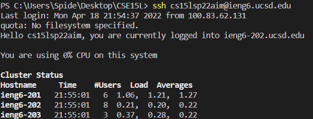
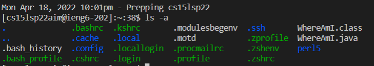
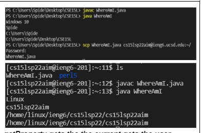
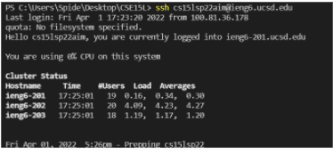
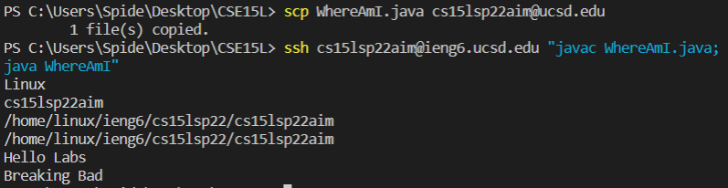
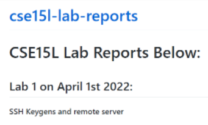
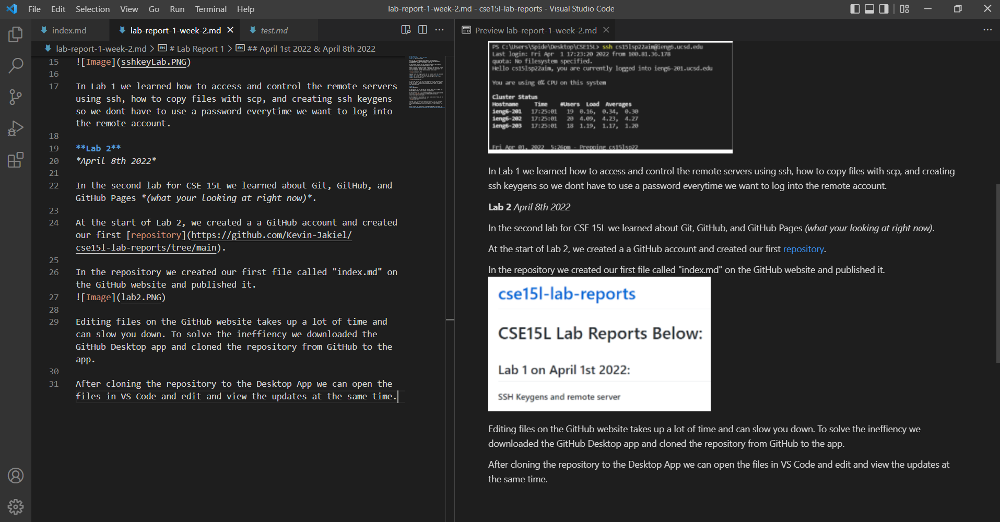

# Lab Report 1
## April 1st 2022 & April 8th 2022
### **Lab 1** *April 1st 2022*

Here is the [link](https://docs.google.com/document/d/17jT1E99qHO9q5prd-BPDhzNqIDCAVYAtavVzt3bCg10/edit#heading=h.4o1hnbkz6val) to week 1 lab report write up.

In the first lab we learned how to 
* Install VS Code
* Remotely conect to our ieng6 account
* Test out commands on the ieng account
* Move files using scp
* Creating an SSH Keygen
* Optimize Remote Running

In the beginning of the lab we had to download VS Code. I already had VS Code installed from CSE8B.

After installing VS Code we had to remotely connect to the schools computer using ssh *User-name@ieng6.ucsd.edu*. Prior to the lab we had to change the password for the ieng6 account.

After connecting to our account, we tested out commands. I tested the command -ls a. This command lists all the files in color and shows hidden files.

After testing out commands we created a file on our main account so we can copy that file to our ieng6 account using scp. Doing all this work took around a min to do, using the up arrow to save time.

Copying files and logging into the ssh account with the password takes a lot of time. So we learned how to create a **ssh keygen** so that we dont have to manually log into our remote computer account every time

At the end of the lab, we learned how to save even more time by combining the lines of scp, ssh, and javac/java.

In Lab 1 we learned how to access and control the remote servers using ssh, how to copy files with scp, and creating ssh keygens so we dont have to use a password everytime we want to log into the remote account.

# **Lab 2** *April 8th 2022*

In the [second lab](https://docs.google.com/document/d/1Nw6gdehL-BzqjeVV1jzi_Ni4cdpx2uquLztLGTdzUdU/edit#heading=h.49e6dmnl0l3f) for CSE 15L we learned about Git, GitHub, and GitHub Pages *(what your looking at right now)*.

At the start of Lab 2, we created a a GitHub account and created our first [repository](https://github.com/Kevin-Jakiel/cse15l-lab-reports/tree/main).

In the repository we created our first file called "index.md" on the GitHub website and published it.

Editing files on the GitHub website takes up a lot of time and can slow you down. To solve the ineffiency we downloaded the GitHub Desktop app and cloned the repository from GitHub to the app.

After cloning the repository to the Desktop App we can open the files in VS Code and edit and view the updates at the same time.

In Lab 2, we learned about Git, GitHub, GitHub pages, how to add files to your repository, how to edit them, how to edit files offline and upload them to the remote repository on the GitHub Website

[Return to Home Page](index.html)