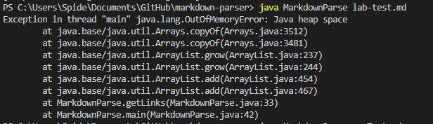
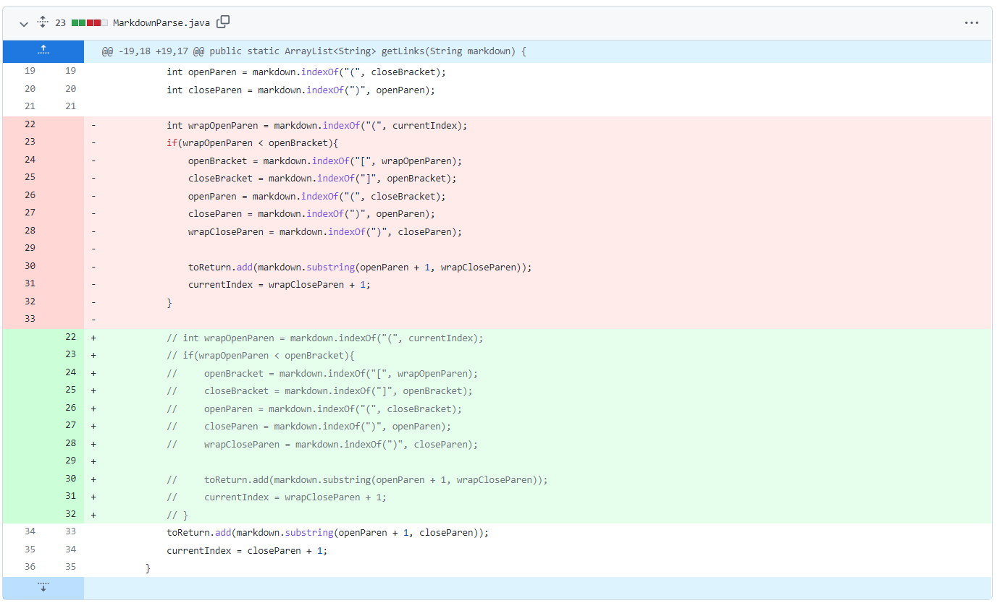
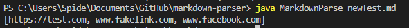
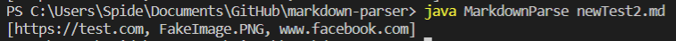
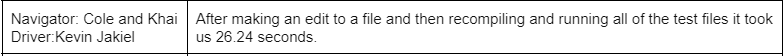
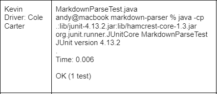
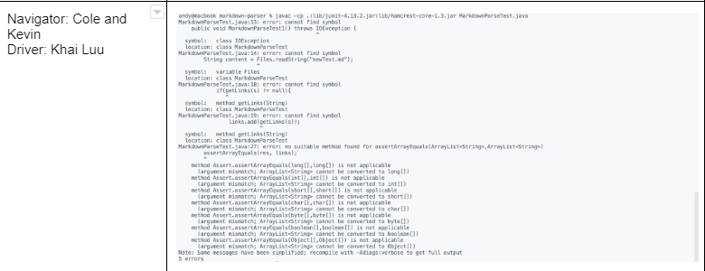
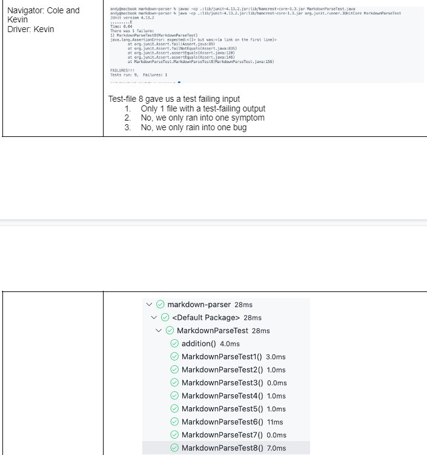

# Lab Report 2 April 15th 2022 & April 22nd 2022
*Disclaimer, my Lab Partner was absent on April 22nd 2022 for Lab 4

## **Lab 3**                                                                       
### April 15th 2022
-------
Here is the [link](https://docs.google.com/document/d/1LnSfvTG_Hn2fxDtFMuhBhJqsf9336Bm1ljux2Af9FqE/edit) for lab 3.

This lab was about incremental development.

In the beginning of the lab we watched a [video](https://www.youtube.com/watch?v=vgkahOzFH2Q&ab_channel=Code.org) about Pair Programming and a [video](https://youtu.be/k67e-Icw4ug) of a code we will use later in the lab

After watching the video we downloaded the same [code](https://github.com/nidhidhamnani/markdown-parser) and ran the code with a given test file to make sure the code works properly.

Our main task for this lab was to find breaking cases for the code and fix them

My first breaking case for the code was to wrap the link in parantheses, you can see the test [here](https://github.com/Kevin-Jakiel/markdown-parser/commit/aab7c1cbe7b61eead4d69da21c9b97a4a259384e#diff-e43b4613bbb760ed086aaca603d22855e4a4e7e59573ebfb147f9b23ed05f3ab)

```
([Link](www.fakelink.com))
```

This method of linking should still work since it is in the same format but with parenthesis surronding the whole thing.

Yet, when the code ran. It failed with an *"OutOfMemoryError"*.


The bug in my code is that in the while loop, that there are two Closing Parantheses' so the value of the closing parantheses changes at the end of the while loop and the code gets confused on which is the ending Closing Parantheses and the code crashes. 


To fix this error, I tried re-editing the code to ignore the wrapping parantheses and just read what is inside. I tried rewriting for the rest of the lab session but could not find a solution.


------
**The next breaking case that I tried was incorrectly writing a .md link, view [here](https://github.com/Kevin-Jakiel/markdown-parser/commit/723e2cb9de811ed549498008bf3c5704c71d92ed) under newTest.md**
```
[test](https://test.com)

[]
(www.fakelink.com)

[realLink](www.facebook.com)
```

The code should not recognize that the second link is not a real link and ignore it. Yet, when ran the code picked up the second link and added it to the array at the end of the code


The bug in my code is that there is a space between the ending bracket and the starting paranthesis that the code does not know. Which causes the code to add the image link to the lists of links at the end.

I wasnt able to fix this error because I was still trying to fix the wrapped parantheses erorr, but theoretically how I would fix it is to split the lines of the .md file and then see if there is a difference in the values
```
public static ArrayList<String> getLinks(String markdown) {
    ArraryList<String> toReturn = new ArraryList<>();
    int currentIndex =0;
    while(currentIndex < markdown.length){
        //Previous lines of code
        int openParen = markdown.indexOf("(", closeBracket);
            if(openParen - closeBracket != 1){
                break;
    }
    return toRetun;
}

public static void main(String[] args) throws IOException {
    //Previous code
    String[] splitList = content.split("\n");
    ArrayList<String> links = new ArrayList<String>();
        for(String s: split){
            if(getLinks(s) != null){
                links.add(getLinks(s));
            }
        }
	    System.out.println(links);
    }
```
----
**The next breaking case that I tried was what would happen if an image was in the file, you can view it [here](https://github.com/Kevin-Jakiel/markdown-parser/commit/502e2d5e20cf754dd80cc2f1da4e3b18fc4263d6) under newTest2.md.**

```
test](https://test.com)


[realLink](www.facebook.com)
```

I knew that the code would add the Image string since there was no if statement to stop the code if there was an !. As seen below, it is what I expected.


The bug in the code as stated above, is that there is nothing stopping the code from differentiate a link and an image, which causes the code to add the image to the list of links, and print out an image in the list of links.

As with the second breaking case I did not fix it because I was working on the wrap parantheses breaking case. How I would fix it though, is by comparing the index of the exclamantion mark and the Open Bracket
```
public static ArrayList<String> getLinks(String markdown) {
    ArraryList<String> toReturn = new ArraryList<>();
    int currentIndex =0;
    while(currentIndex < markdown.length){
        //Previous Code

        int exclamantion = markdown.length("!");
        if(exclamation < openBracket && exclamation != -1){
            break;
        }

        //Previous Code
    }
    return toRetun;
}
Main bethod below
```
-------------------
## Lab 4
### April 22nd 2022

The lab writeup can be viewed [here](https://docs.google.com/document/d/1lAyC-DbG6pt2tG-VL_6Jh5HaSUaXSLKFI0CxpOIfK8E/edit)

In Lab 4, we did JUnit Tests for our code from lab 3. As stated at the top of the page my lab partner was not here so I joined Cole's and Khai's group.

The first two lab activites were running the method on the test files. Which I was the driver for this activity


After running the code, we were tasked with downloading JUnit, set it up, write a practice test, and then create more test with given [files](https://github.com/nidhidhamnani/markdown-parser)

Cole was the driver for setting up the JUnit.


Khai was the driver for writing the JUnit test and show an error screenshot we had.


After Khai fixed the errors we moved on to the next and last part of the lab which was writing JUnit tests with the test files linked above.

For this part of the lab we were all the Drivers and Navigators because we each wrote a test or two


[Return to Home Page](index.html)