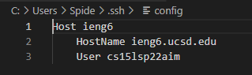
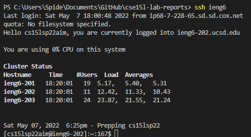
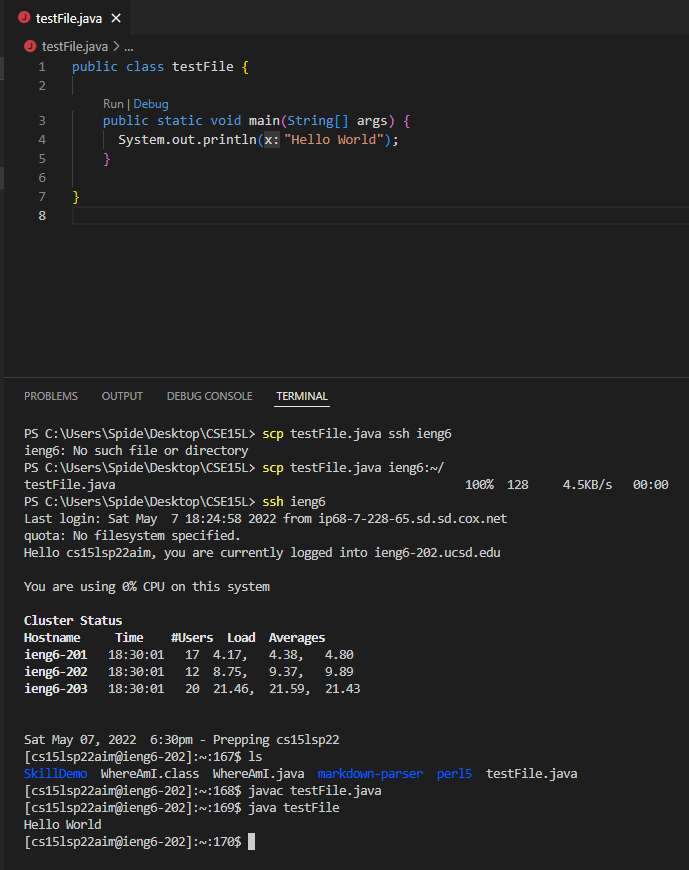
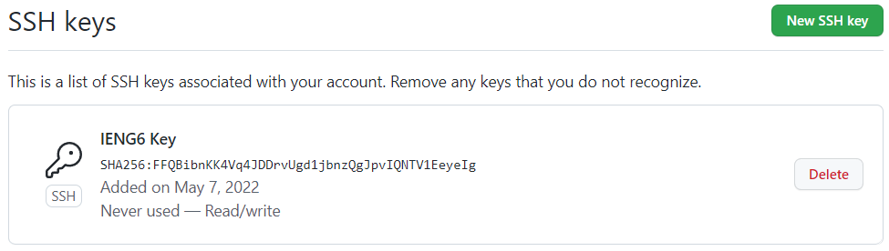
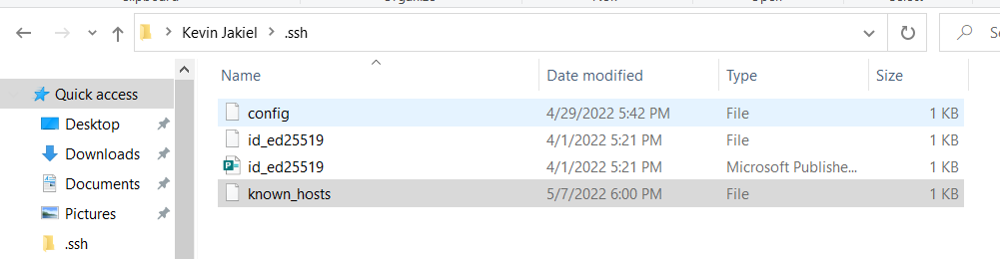
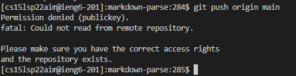
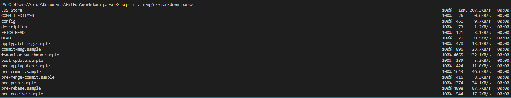

# Lab Report 3 April 29th 2022

## Lab 5
### April 29th 2022

Here is the [write-up](https://docs.google.com/document/d/1NQ17hecUPFKeoFyrEvK9DBlCS1JkDbMW6Ygrf_CJJJU/edit#) for lab 5.

**Part 1** : Streamlining ssh Configuration

Step one, we had to create a config file and our our host information

Step two, logging in with ssh is even easier, as we only have to type the host in the terminal

Step three, copying files with scp is easy aswell as we only have to type the host and the path

------------

**Part Two** : Setup Github Access from ieng6

Step one, for the first part of this activity we had to copy our ssh public key and add it to our github profile

Step two, running git commands Does not work for me yet, going to the next available tutor hour to resolve issues

Issues I have, ive recreated my ssh-keygen and added it to my Github account. After those steps I launched VS Code to create and edit a basic file using VIM. After creating the file, I used the git commands

    git add labTest.java
    git commit -m "Adding Lab Report Test"
    git push origin main
and then i end up with this error

------------------

**Part Three**
For this lab activity we copied the whole directory from our main account to our ieng6 account

After copying the directory and trying to run the tests I was gettings errors and tried going to piazza to fix my errors yet it still would not work.
Going to tutor hours to resolve my issues.

[Return to Home Page](index.html)