# Lab Report 4 May 18th 2022

## Lab 7
### May 18th 2022

Here is the [write-up](https://docs.google.com/document/d/1DasH1YP2offEjtiZ4_zsKOEORUkwWhqTYfAaloEmE-g/edit) for lab 7.

My own Markdown Parser [code](https://github.com/Kevin-Jakiel/markdown-parser) for tests

Reviewed Markdown Parser [code](https://github.com/philliptwu/markdown-parser) we reviewed in Lab 7.

----
## Snippet 1

```
`[a link`](url.com)

[another link](`google.com)`

[`cod[e`](google.com)

[`code]`](ucsd.edu)
```
Output it should produce, from [CommonMark](https://spec.commonmark.org/dingus/)

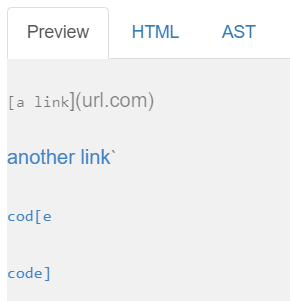

Only (`google.com, google.com, and ucsd.edu) are valid links

Code and Output from my Markdown Parser

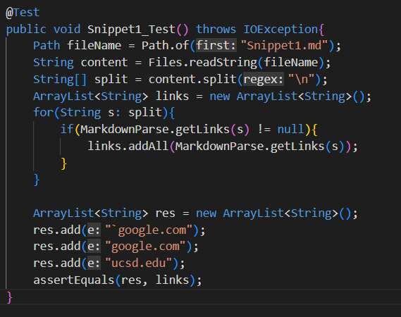

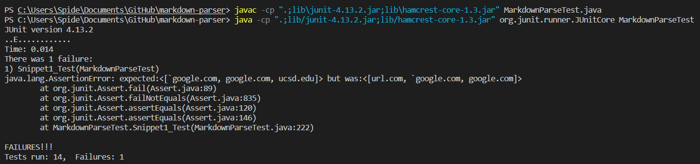
My code was not able to correctly find the right links, it found 2 out of the 3 correct links. It did not recognize ucsd.edu as a viable link but found that url.com was.

Code and Output from reviewed Markdown Parse

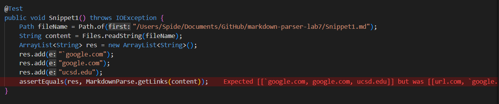

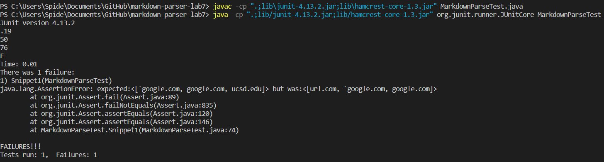

Similar to my code, the reviewed code got the wrong links aswell.

---

## Snippet 2
```
[a [nested link](a.com)](b.com)

[a nested parenthesized url](a.com(()))

[some escaped \[ brackets \]](example.com)
```
The expect output it should produce from [CommonMark](https://spec.commonmark.org/dingus/)

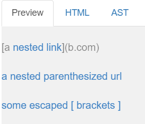

Code and Output from my Markdown Parser

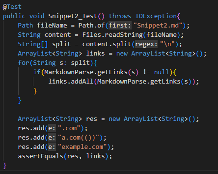

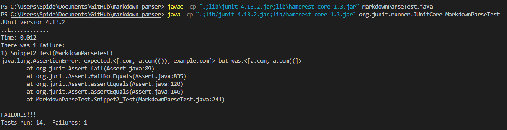

I was actually suprised by the outputted results. I did not think that it would get the first a.com, i thought it would output a.com and b.com

Code and Output from reviewed Markdown Parser Code

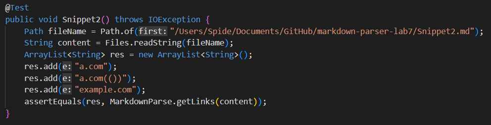

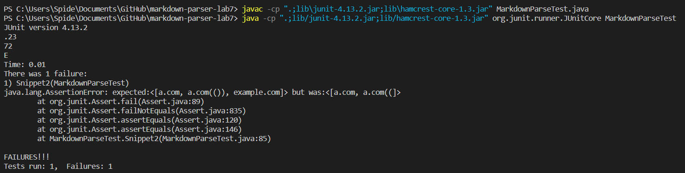

Similarily to my Markdown Parser it gave the same result.

----

## Snippet 3

```
[this title text is really long and takes up more than 
one line

and has some line breaks](
    https://www.twitter.com
)

[this title text is really long and takes up more than 
one line](
https://sites.google.com/eng.ucsd.edu/cse-15l-spring-2022/schedule
)


[this link doesn't have a closing parenthesis](github.com

And there's still some more text after that.

[this link doesn't have a closing parenthesis for a while](https://cse.ucsd.edu/


)

And then there's more text
```

The website and VS Code preview gave two different outputs so I will use VS Code's output for this one

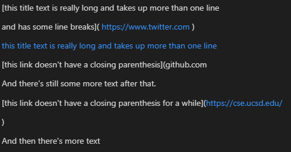

Code and Output from my Markdown Parser

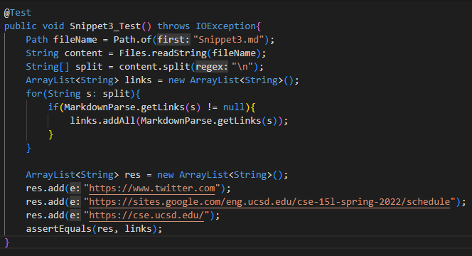

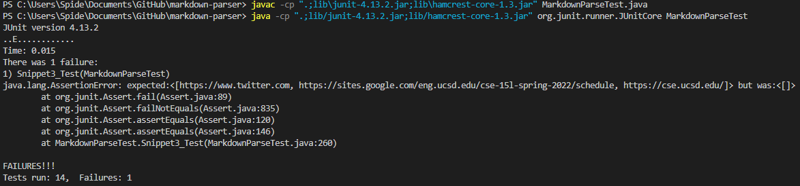

Im not really suprised by the output my markdown parser gave. This snippet had big gaps, excluding paranthesis and brackets

Code and Output from reviewed Markdown Parser

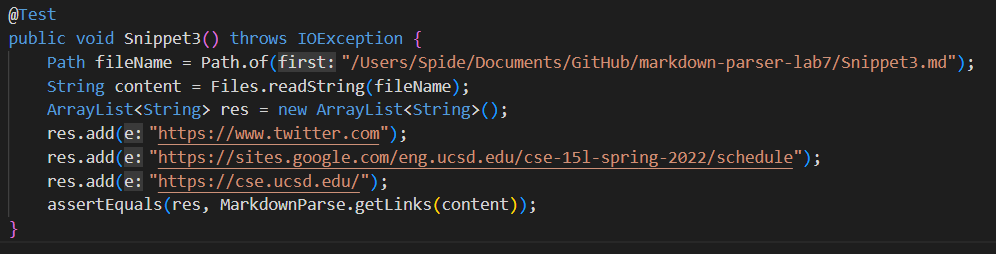

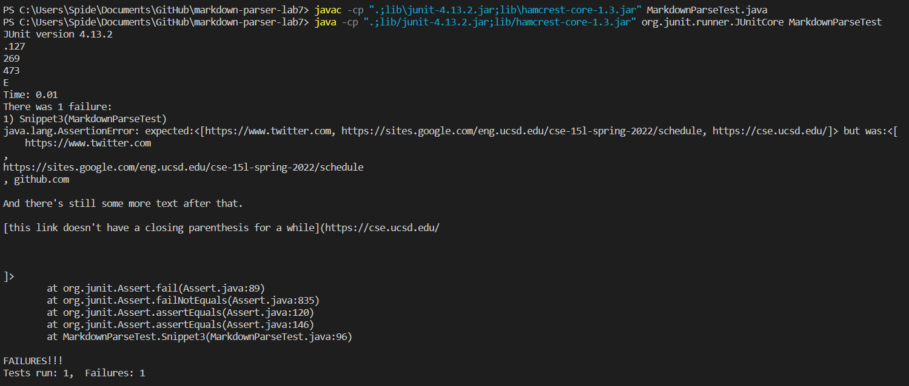

Im actually really surprised by the results of this output. because it has all the spaces and other unneccesary stuff that should not be in the output.

---
## Answers

1) For snippet 1, I think there is a solution for backticks. In the code my lab partner and I have, is a bunch of if else statements, so I think if we just add another If statement to check the distance of the back ticks in the markdown file then it might work fine. Im not 100% sure on that solution but that is what my first thought and implementation would be

2) For snippet 2, I think nested links and nested paranthesis would take a little more than 10 lines to check for a nest link or paranthesis. I also think that the version of the markdown parser is not the best with just having if else statements.

3) Snippet 3 is one of the most complex snippets out of the three, but what i forgot that my code does, is that it splits the code and removes all the spaces in the code which may or may not be a good thing in some cases such as this. But I think that this will need more than 10 lines to check the spaces, closed paranthesis or complete paranthesis. The one thing im confident on, is that the code can handle long texts in the middle of the file and ignore them.

[Return to Home Page](index.html)