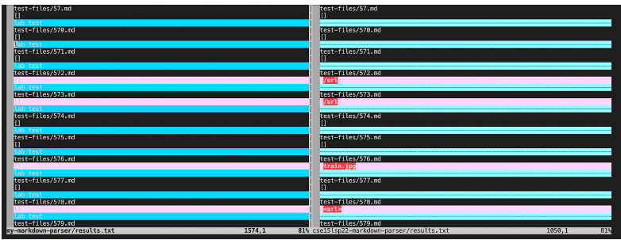
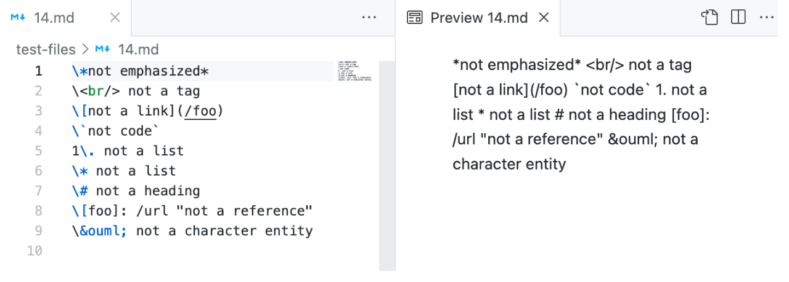
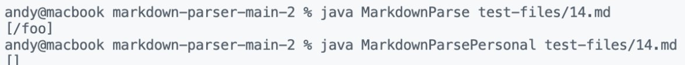
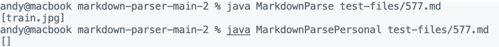

# Lab Report 5 May 27th 2022

## Lab 9
### May 27th 2022
#### Note: I could not make it to this lab due to health concerns. 



From my lab partner, here are a couple different test files that have different outputs. 

Aung used vimdiff to compare the two files
```
$ vimdiff my-markdown-parser/results.txt cse15lsp22-markdown-parser/results.txt
```

He scrolled through vimdiff manually to see what tests were different.

# First Test



(from Khai)

The first test file contains no links 


from(Khai)

The actual output should be [] as seen from Khai's MarkdownParsePersonal file.
The given code from MarkdownParse had a bug where it does not account for backslashes

# Second Test


(from Khai)

The second test contains an image which is not a link


(from Khai)

The actual output should be [] as seen from Khai's MarkdownParsePersonal file.
The given code from MarkdownParse had a bug where it does not account for the exclamation point infront of the image.


[Return to Home Page](index.html)